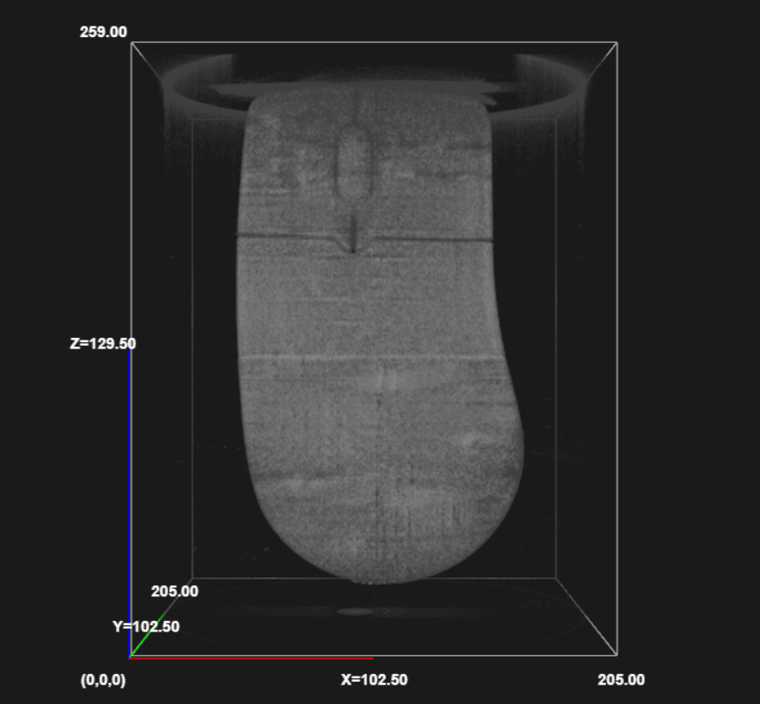
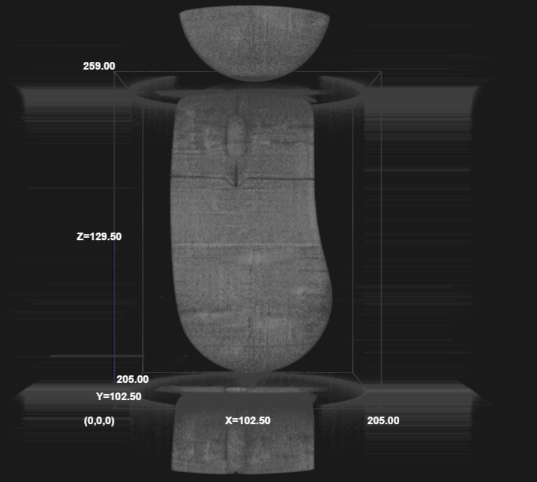
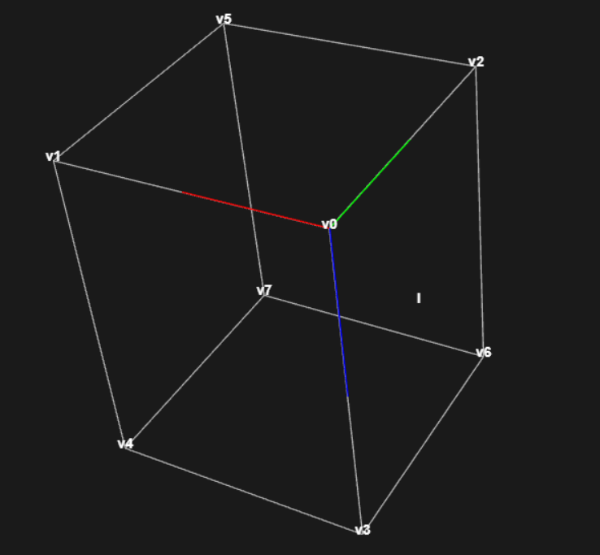
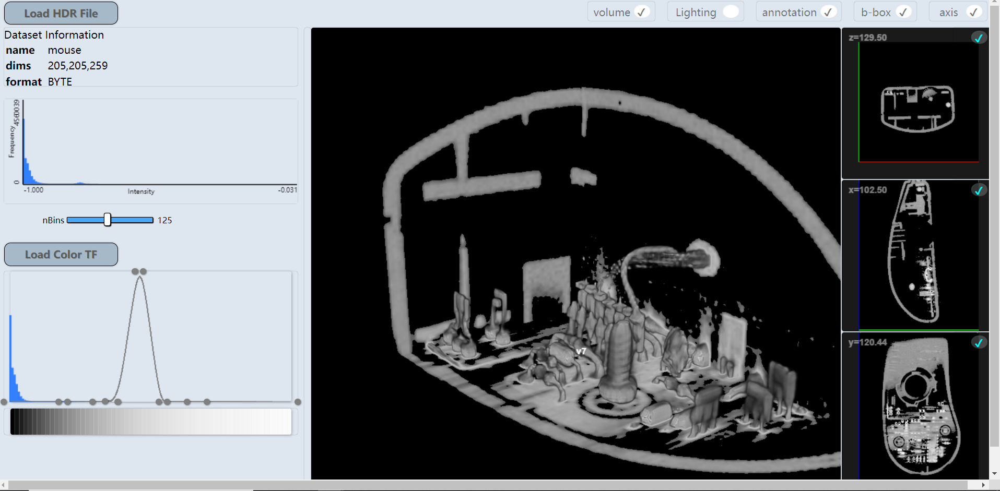
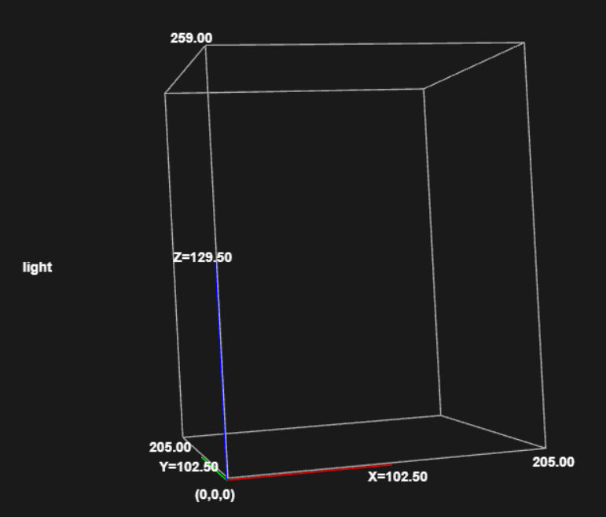
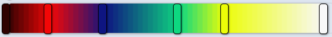
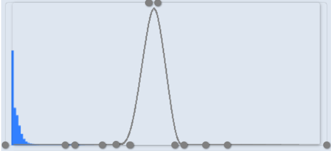

# Implementation Description

## 1. View-Aligned Polygon
The polygons are implemented by clipping each plane at cube boundary, as the algorithm described in "Real-Time Volume Graphic". The instanced polygon method are implemented as well since I did it first, and the codes for instanced polygon are reserved. To see the difference between these two methods, I turned off discarding fragments outside bounding box in the shader program for instanced polygon, and the comparison is clear(no lighting and blending is done in the images below):

 



Shader program for each approach is reserved as well. For clipped method, the shader program is `viewAlignedPlaneVsSrc` and `viewAlignedPlaneFsSrc`. For instanced method, it's `viewAlignedPlaneInstancedVsSrc` and `viewAlignedPlaneInstancedFsSrc`. 

### 1.1 Vertex ordering
Codes for clipped method is implemented in `renderViewAlignedCuttingPlanes()` in `VolRenderer.js`. There are three core arrays that needs to be defined for this method: `v1`, `v2` and `nSequence`. They all store vertex indexes that will be used in the shader program. In the algorithm, they are designed to be constant for simplicity, and they will be the same as long as the topology for cube vertex index is fixed, so I just hard-coded them:
```javascript
// line 582-608 in VolRenderer.js
let v1 = new Float32Array([
    0, 1, 4, 4,
    1, 0, 1, 4,
    0, 2, 5, 5,
    2, 0, 2, 5,
    0, 3, 6, 6,
    3, 0, 3, 6
])
let v2 = new Float32Array([
    1, 4, 7, 7,
    5, 1, 4, 7,
    2, 5, 7, 7,
    6, 2, 5, 7,
    3, 6, 7, 7,
    4, 3, 6, 7
])
let nSequence = new Float32Array([
    0, 1, 2, 3, 4, 5, 6, 7, // frontIndex = 0
    1, 4, 5, 0, 3, 7, 2, 6, // frontIndex = 1
    2, 0, 5, 6, 3, 1, 7, 4, // frontIndex = 2
    3, 0, 6, 4, 1, 2, 7, 5, // frontIndex = 3
    4, 3, 7, 1, 0, 6, 5, 2, // frontIndex = 4
    5, 1, 7, 2, 0, 4, 6, 3, // frontIndex = 5
    6, 2, 7, 3, 0, 5, 4, 1, // frontIndex = 6
    7, 6, 5, 4, 3, 2, 1, 0, // frontIndex = 7
    
])
``` 
The values of these arrays are index for cube vertices. To make it work, I also need to change the order of vertices in bounding box geometry. The result should be like the following, so that it has the same order as in "Real-Time Volume Graphic" page 73. And as long as the bounding box geometry stays like the following, `v1`, `v2` and `nSequence` will be constant.


### 1.2 Vertex Shader
The vertex shader is almost the same as given in the book. The only difference is that I used `glDrawArraysInstanced` as suggested in https://campuswire.com/c/G46B6B5FF/feed/34

In this way, when I find the six vertices for the polygon, I can use `gl.TRIANGLE_FAN` to draw it, and `Vin` is just index for the six vertices:
```javascript
// line 634 in VolRenderer.js
Vin = new Float32Array([0, 1, 2, 3, 4, 5])

...

// line 719 in VolRenderer.js
gl.drawArraysInstanced(
			gl.TRIANGLE_FAN, 
			0, 
			Vin.length, 
			NSample );
```

## 2. Blending
Blending is done according to PA3 slides. In order to let webgl enable blending, colorTF buffer and opacityTF buffer need to be merged. This is done by:
```javascript
// line 1069 in VolRenderer.js
setColorTF(colorTF, opacityTF)
{
    // merge colorTF and opacityTF together
    var colorAlphaTF = new Float32Array(colorTF.length + opacityTF.length) 

    for(var i = 0; i < opacityTF.length; i++) {
        colorAlphaTF[4*i] = colorTF[3*i]
        colorAlphaTF[4*i+1] = colorTF[3*i+1]
        colorAlphaTF[4*i+2] = colorTF[3*i+2]
        colorAlphaTF[4*i+3] = opacityTF[i]
    }   
    ...
    gl.texImage2D(
			gl.TEXTURE_2D,       // texture type
		    0,                   // level
			gl.RGBA32F,           // internalFormat
			colorAlphaTF.length / 4,  // width
			1,                   // height
			0,                   // border
			gl.RGBA,              // format
			gl.FLOAT,            // type
			new Float32Array( colorAlphaTF ) );       // data
    ...
}
```
Since the merge is done in `VolRenderer`, `TFView` can still manage color and opacity TF separately. However, for the above merge to work, opacityTF must have a length of colorTF.length/3. To assure that, in `TFView`, if user loads a new colorTF, opacity buffer will need to be recalculated. This is done by:
```javascript
// line 476 in TFView.js
updateOpacityBufferFromTFControls() {
    this.opacityBuffer = new Array(this.colorBuffer.length/3)
    ...
}
```
The effect of blending is significant(without lighting):


## 3. Lighting
For lighting, I used a single point light source at fixed position. The position is left of the left plane in the following. `renderText()` is used to indicate the location of light source.


Phong Model is used, with ambient light set to 0, and specular term is 1. `Half Vector` is used to speed up the calculation.
```javascript
// line 236 in VolRenderer.js
float light = 1.0;
float specular = 0.0;
if(doLighting == 1) {
    // use central differences to calculate vertex normal
    // the denomimator is skipped since we'll normalize it
    float v_normal_x = 
        texture(volSampler, vec3(
            texCoord.x + h_x,
            texCoord.y,
            texCoord.z
        )).r 
        -
        texture(volSampler, vec3(
            texCoord.x - h_x,
            texCoord.y,
            texCoord.z
        )).r;
    float v_normal_y = ...
    float v_normal_z = ...
    vec3 v_normal = vec3(v_normal_x, v_normal_y, v_normal_z);
    vec3 normal = normalize(v_normal);
    
    vec3 surfaceToLightDirection = normalize(v_surfaceToLight);
    vec3 surfaceToCamDirection = normalize(v_surfaceToCam);
    vec3 halfVector = normalize(surfaceToLightDirection + surfaceToCamDirection);
    light = dot(normal, surfaceToLightDirection );
    specular = dot(normal, halfVector);
}
color.rgb *= light;
color.rgb += specular;
```
Lighting is only done in shader program for clipped method.
## 4. Color TF Editor
The operation of colorTF editor is simple: 

1. To add a control point, just double click on the position. The default control point color will be the color on the canvas point. So you won't change the transfer function until you move the control point or assign a new color to it.
2. To change the color of a control point, right click on the control point and choose a color. Color TF will be linear-interpolated as you choose different color. You can also drag the control point to move it, but you can't move the start and end control point, only change the color of them.
3. To delete a control point, middle-click on the control point.


## 5. Opacity TF Editor
The operation of opacity TF editor is similar to color TF editor: double click to add, middle click to delete, drag to move. The start and end control point can not move horizonally, but can move vertically to change the opacity value. The background of opacity TF canvas is the same as histogram view, to show the user what data values they're affecting:


### Interpolation
I implemented cubic B-spline interpolation for opacity TF. The basis function is defined at line 294, TFView.js. The curve is interpolated in both x and y axis:
```javascript
// line 335 in TFView.js
B_spline(n, u, k, t, w) {
    var point = {
        x:0,
        y:0
    }
    var sum = 0
    for(var i = 0; i < n+1; ++i) {
        var factor = this.B(i, k, u, t);
        point.x += w[i].px * factor
        point.y += w[i].py * factor
        sum += factor
    }
    return point;
}
```
In the above function, `n+1` is the amount of control points, `u` is parameter for interpolation, `k` is the degree, `t` stores the knot values, `w` stores the control points. The return value is a point on the curve.

#### **Domain of u** 
Since `u` in `B_spline()` should range from `t[k-1]` to `t[n+1]`, it is defined as follows:
```javascript
var spline = new Array(spline_length)
    for(var u = 0; u < spline_length; u++) {
        var ui = t[k-1] + u*(t[n+1]-t[k-1])/(spline_length-1);
        spline[u] = this.B_spline(n, ui, k, t, w)
    }
```
In the code above, we are sampling points for an amount of `spline_length` points and store them into array `spline`. So we first convert the index into parameter for `B_spline()` as `ui`.

#### **degree**
Cubic B-Spline Interpolation requires at least four control points, but initially we have only two control points. So we need to degrade our B-spline when we don't have enough control points, and only interpolate in cubic when we have at least four:
```javascript
let k = 4;
if(sortedPoints.length <= 4) {
    k = sortedPoints.length-1
}
```
#### **knot values**
For the B-spline curve to go through the first and last control point, there must be at least **k+1** zeros and **k+1** ones at the front and end of our know value array. The slots left should be range between 0 and 1. I found this conclusion in page 4 of: https://www.geometrictools.com/Documentation/BSplineInterpolation.pdf
This material helped me a lot with B-spline interpolation. 
```javascript
// 0
for(var i = 0; i < k+1; ++i) {
    t[i] = 0
}

// 0-1
var f = n+k+2 - (2*k+2)
for(var i = 1; i <= f; ++i) {
    t[i-1+k+1] = i/(f+1)
}

// 1
for(var i = 0; i < k+1; ++i) {
    t[i + k+1 + f] = 1
}
```