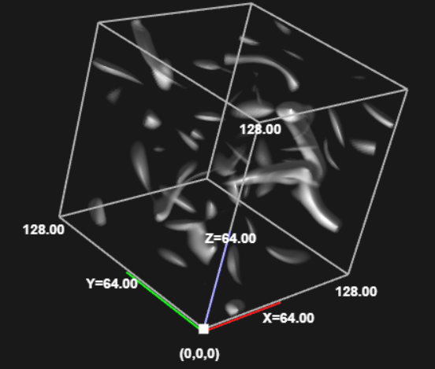
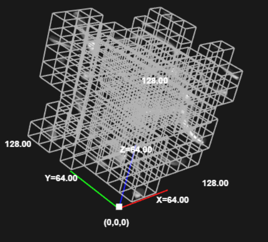
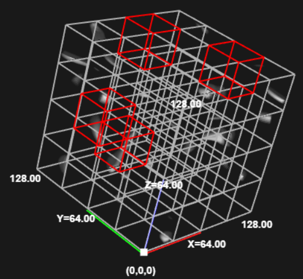
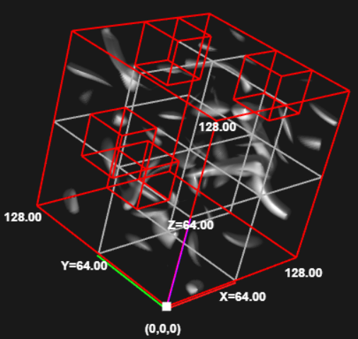
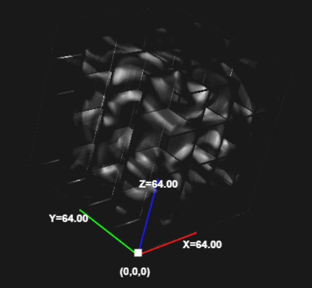
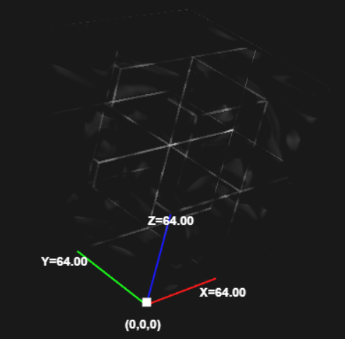
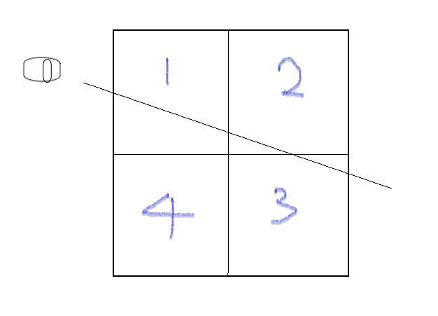
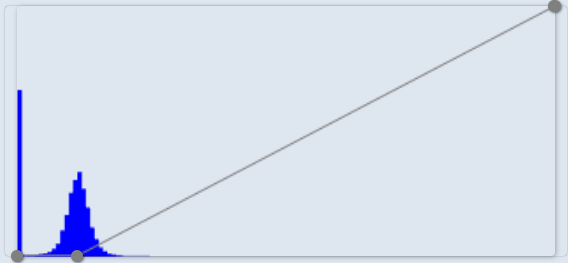

# Final Project Summary
This project implements `SparseLeap`[1], as well as approximated geomeotry skipping and octree-based skipping as comparison. 

[1] Hadwiger, Markus, et al. "SparseLeap: Efficient empty space skipping for large-scale volume rendering." IEEE transactions on visualization and computer graphics 24.1 (2017): 974-983.


# User Interface
**1. Switching between empty space skipping methods**: On the top right corner of volume canvas is a set of checkboxes to choose between different skipping methods. 

**2. Disable/Enable bounding boxes**: The bounding box of different methods can be turned on/off by the `b-box` checkbox. The bounding box shows the geometry for different methods. Red boxes are `empty` boxes, white boxes are `non-empty` boxes. 

Bounding Box for different methods: 
**(1)** no skipping **(2)** approximated geometry **(3)** octree **(4)** SparseLeap 






**3. Visualizing Depth Complexity**:
In `SparseLeap`, they visualize the depth complexity of different methods by assigning depth as brightness to each pixel. The brighter a pixel, the depth complexity is higher, meaning that the ray jumps more steps. I do the same in my project for octree and SpraseLeap. This feature can be turned on/off by `Depth` checkbox. 
This is a result of this feature: It's obvious that octree skipping has brighter rendering result, as a result of highter depth complexity.

**Left:** Octree. &nbsp;**Right:** SparseLeap.




# Unexpected Limitations 
**1. Simplified Octree**:
There are two limitations because of my octree implementation is simplified. First is that the dataset resolution can only be power of two. Second is that there are some artifacts at the boundary of each node. This limitation is not stated in my project proposal. Here is the reason:

In this project I implemented three empty space skipping methods: approximated geometry, octree-based skipping and SparseLeap. Unfortunately, implementing octree totally from scratch is too much harder than I thought. To make things worse, SparseLeap is also octree-based, so I have to implement octree first. I ended up spending too much time implementing octree instead of SparseLeap, which should be the focus of this project. At some point, I decided that I have to move on to SparseLeap, or I won't be able to finish this project. As a result, I have to do some simplification on the octree. First is that the dataset resolution can only be power of two, this way all non-leaf node will have exactly eight children, which simplifies the implementation by a lot. Second is the artifact at node boundaries. This is because for sample points at the boundary, I'm having a hard time deciding which leaf node it should be in. I've tried different possible solutions, but none of it works. To debug this problem in shader program is even more difficult. I was just unable to solve it in time. 

**2. Maximum resolution**: Another limitation is that the maximum resolution of dataset is 512x512x512. 

As is mentioned in my project proposal, I don't have an out-of-core rendering system. What I didn't expect is that, webgl has limitations on texture dimensions. A dataset with 1024x1024x1024 resolution will exceed its limitation. Plus that I can only accept dataset resolution at power of two, the maximum dataset resolution I can render is 512x512x512. 

# Implementation
## 0. Update Occupancy Class
For octree and SparseLeap, a significant performance bottleneck is to update the occupancy class for octree nodes. To update the class for a node, brute-forcely we should check all the data in this node by applying it to opacity transfer function. But it will be extremely slow. The optimization I made is descibed below:
<br/>
First I divide the whole volume into small bricks of the same size, say 16^3. Then I compute a metadata for each brick, containing the min-max in this brick. This metadata will only be computed once, which is when the data is loaded. Afterwards, when I need to update the occupancy class for a octree node(usually when the transfer function changes), I check the bricks emptiness in this node by applying the new transfer function to the data value ranging in (min, max). If all the values have 0 opacity value, then the brick is empty. If all the bricks in this octree node is empty, than the occupancy class is empty. 
<br/>
This is obviously an approximation, but it will significantly improve performance. 

## 1. Approximated Geometry
Approximated Geometery is implemented in `ApproxGeometry.js`. It uses small brick of the same size to approximate the non-empty volume. The process is quite simple: using the method that decides if a brick is empty, we save only the non-empty bricks. The bricks together forms our approximated geometry. In the rasterization process, we first render the entry and exit point for our overall geometry to a texture, and then use the texture in our actual ray-casting pass. 
<br/>
According to this paper:
<br/>
`M. Hadwiger, C. Sigg, H. Scharsach, and K. Bühler. Real-Time RayCasting and Advanced Shading of Discrete Isosurfaces. Computer
Graphics Forum (Proc. Eurographics ’05), 24(3):303–312, 2005`
<br/>
The entry and exit point can be retained with `gl.LESS` and `gl.GREATER` in depth test. But this method doesn't work for some unknown reason. After much struggling, I come up with an alternative approach to retain the entry and exit point, the drawback is it takes two rendering pass each. I used `blendFunc` of `gl.Min` and `gl.Max` instead of depth test. Take exit point for example, the first rendering pass I use `gl.Max` as my blend func, and render the depth value of each fragment to its `r` component. With `gl.Max`, only the maximum depth value stays in the framebuffer. The second pass, I discard the fragments that has a smaller depth value than in the buffer, and write the position of the only fragment left to its `rgb` component. The same process is applied for entry points with `gl.Min` instead. This is implemented in `renderApproxEntryPoints()` and `renderApproxExitPoints()` in `VolRenderer.js`. 

As is mentioned in the paper, this method can only skip exterior empty spaces. It's implemented as a baseline for SparseLeap. 

## 2. Octree-based skipping
Octree is implemented in `Octree.js`. A challenge for implementing octree-based ray casting is to encode the tree information in texture. My octree texture is inspired by this paper:
<br/>
`E. Gobbetti, F. Marton, and J. Guitián. A single-pass GPU ray casting
framework for interactive out-of-core rendering of massive volumetric
datasets. The Visual Computer, 24(7):797–806, 2008`

The ray-casting process using octree is:
1. Given an entry point, do a depth-first traversal to find out which leaf node it is in.
2. Calculate the exit point on this leaf node by calculating line-box intersection point.  
3. If the node is a non-empty node, render from entry point to exit point. 
4. Assign exit point to entry point. Repeat this process.
   
The key here is to do depth-first traversal inside shader program. First is to encode the tree structure into a 1-D array. This is done by doing a breadth-first traversal on the octree. For each node, it must pass three information to the shader:

1. startPoint and endPoint of bounding box. This is used to decide if a sample point is in this node. Also used in line-box intersection calculation. 
2. children index in the octree array. In order to do dfs, a node must be able to point to its children. 
3. node occupancy class. Used for empty space skipping. 

To provide those information, I created three textures:

**1. octreeStartPointTexture**: stores the start point of each node in rgb component.

**2. octreeEndPointTexture**: stores the end point of each node in rgb component.

**3. octreeTagTexture**: stores (firstChildIndex, occupancyClass) in rg component.

Due to the simplification mentioned earlier, each node will have exactly eight children. So we only need `firstChildIndex` to do dfs. These textures are implemented in `setOctreeTexture()` in `VolRenderer.js`. 

## 3. SparseLeap
SparseLeap is implemented in `SparseLeap.js`. The construction of `occupancy histogram tree` and `occupancy geometry` is trivial, so I won't describe them in detail here. The `Visibility Order` is what struggles me a lot. It is I think the key that makes SparseLeap efficient. 
### Visibility Order
To understand the usage of visibility ordering, the key is to understand `occupancy geometry`. Contrary to common definition, `occupancy geometry` is not the coordinates that define the faces. Instead, it is a sub-tree of the overall octree. In this sub-tree, we store only the nodes that have different occupancy class than its parent. In the generation process of ray events, we need to somehow traverse this sub-tree. Most importantly, the traversal of a node's children needs to be done in a certain order, according to different ray direction. Below is an example:



In this example, we need to test the intersection of our ray and the children node `1,2,3,4` in order `1,2,3`. So that the ray event for intersecting node `1` is generated first, then node `2` and node `3`. If we test the children randomly(like we did in octree), then it's possible that the ray event for node `3` is generated before node `2` and node `1`. The visibility order is what ensures this doesn't happen. In addition, visibility order also avoids traversing the tree hierarchically. In fact, the generation of ray event is a linear traversal through the visibility order array(see example below). 
In my implementation, the visibility order of the children is decided by the distance of a child to the camera. The order is stored in an array, each element has two components: **(1)** index **(2)** front/back face. The index gives the index of this node in occupancy geometry. front/back face gives indicates we're entering this node, or exiting this node. The visibility order needs to be calculated everytime view changes. Result of visibility order in the above example is like:
```javascript
VisibilityOrderArray = [(1,front), (2,front), (2,back), (3,front), (3,back), (1,back)]
```
Traversal through the visibility order array generates ray events. The pseudo code can be briefly described as:
```javascript
for(voIndex = 0 to VisibilityOrderArray.length) {
    int testedNodeIndex = VisibilityOrderArray[voIndex].x
    treeNode testedNode = occupancyGeometry[testedNodeIndex]
    if(ray intersects testedNode) {
        eventType = VisibilityOrderArray[voIndex].y // entry/exit
        depth = ...
        eventOccupancyClass = ...
        rayEventList.addRayEvent(depth, eventType, eventOccupancyClass)
    }
}
```
Similar to octree, the occupancy geomtry and visibility order needs to be passed to shader program as texture. This is implemented in `setOccupancyGeometryTexture()` in `VolRenderer.js`. Four textures are used: `occuGeoStartPointTexture`, `occuGeoEndPointTexture`, `occuGeoTagTexture` and `visibilityOrderTexture`. 
 
# Evalutaion 
As is mentioned in the paper, the sparsity of data will greatly affect the performance on different methods. So for some dataset, sparseLeap is not performing better than no skipping at all. But regardless of the sparsity, sparseLeap always out-performs octree-based and approxiamted geometry skipping. 

Basic information of the dataset:
| name | resolution | data type | size | 
--- | --- | --- | --- |
Head Aneurism | 512x512x512 | uint16 | 256.0 MB |
Vortices | 128x128x128 | float | 8.1 MB |
Bonsai | 256x256x256 | uint8 | 16.0MB |

I use the following opacity tf:



Below table gives the fps for each method:

| dataset | No skip | Approx | Octree | SparseLeap |
----- | ----- | ----- | ----- | ---- | 
Head Aneurism | 35  | <10  | 20 | 40 |
Vortices | 130 | 60 | 100 | 110 |
Bonsai | 100 | 55 | 90 | 100 |